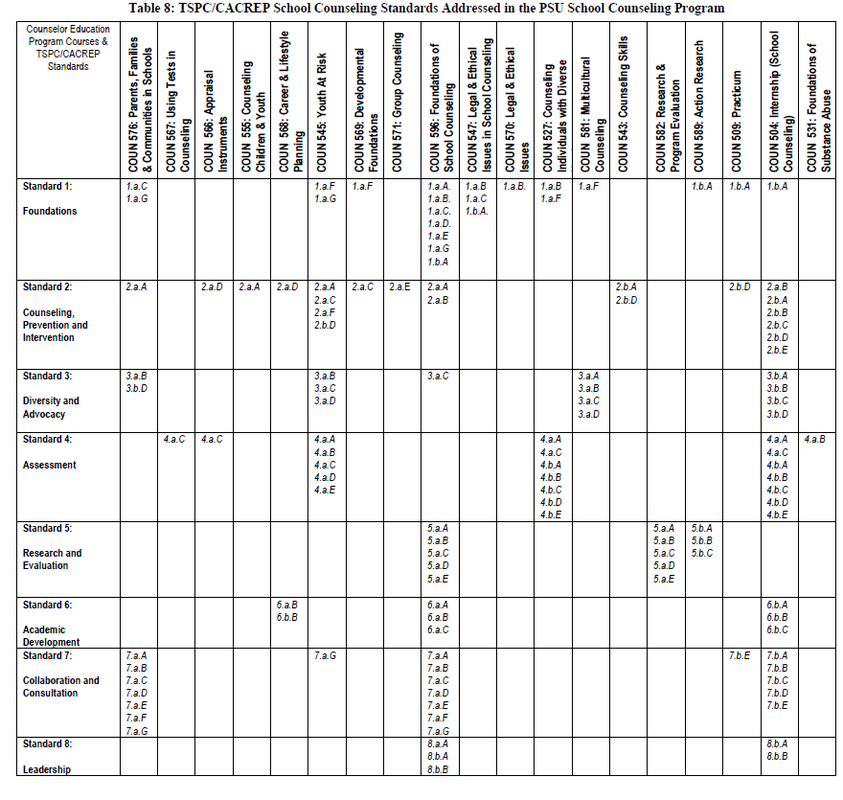



* [Internship](/internship)
* [Clinic Practicum](#clinic-practicum)
* [School Counseling Syllabus](#school-counseling-syllabus)
* [TPSC Competencies](/competencies)

## [Clinic Practicum]()

### Community Counseling Clinic Experience

Portland State University  
Spring 2013-Winter 2014  

As part of my clinic practicum training, I provided counseling services once a week (43 direct client hours) for Portland community members. During this time, I worked with five individuals and a couple on issues such as anxiety, depression, trauma, self-image, divorce, self-care plan and co-parenting. Major techniques used were Cognitive Behavioral Technique (CBT), Emotion Focused Therapy (EFT), Mindfulness and Dialectical Behavioral Therapy, along with basic counseling skills based on Gerard Egan Counseling Model (Active Listening, Empathy, Reflection, Motivational Interviewing, Immediacy, Goal Setting and Challenges for change). 

## [School Counseling Syllabus]()

As a School counseling candidate, I went through the [professional
transformative school counseling curriculum](http://www.pdx.edu/coun/sites/www.pdx.edu.coun/files/School%20POS%202011.pdf)
that prepared me to develop comprehensive school counseling programs based on
the American School Counselor Association National Model, Oregon's
Comprehensive Counseling and Guidance Framework, and Oregon's Teacher Standards and Practices Commission.  School counselors from Portland State University are informed by
[mission](http://www.pdx.edu/coun/school-counseling-mission-statement) and
a vision for school counselors that defines five school counselors
competencies: (1) leadership, (2) advocacy, (3) teaming and collaboration, (4)
counseling and coordination, and (5) assessment and use of data.

---

### Year 1

* [Theories and Interventions I](/assets/resources/pdx-graduate/coun_551_theories_and_interventions_i.pdf)
* [Developmental Foundations](assets/resources/pdx-graduate/coun_569_developmental_foundations_of_counseling.pdf)
* [Effective Teaching - Fall and Winter](assets/resources/pdx-graduate/coun_526_effective_teaching.pdf)
* Practicum: Group Counseling (ETC)
* [Using Tests in Counseling](assets/resources/pdx-graduate/coun_567_using_tests_in_counseling.pdf)
* [Appraisal Instruments](assets/resources/pdx-graduate/coun_566_appraisal_instruments.pdf)
* [Multicultural Counseling*](https://docs.google.com/a/pdx.edu/document/d/13zyCoGgO7NjRgpOId_yxR8itpXqWVeIBPUcvseSyLrY/edit)
* [Diagnosis and Treatment Planning I](assets/resources/pdx-graduate/coun_585_syllabus.pdf)
* [Career and Lifestyle Planning](assets/resources/pdx-graduate/coun_568_career_and_lifestyle_planning_anctil.pdf)

---

### Year 2

* [Parents, Families and Communities in Schools](assets/resources/pdx-graduate/coun_576_parents_families_and_communities_syllabus.pdf)
* [Counseling Individuals with Diverse Needs](assets/resources/pdx-graduate/coun_527_counseling_individuals_with_diverse_needs.pdf)
* [Group Counseling](assets/resources/pdx-graduate/coun_571_group_counseling_syllabus.pdf)
* [Legal and Ethical Issues in School Counseling](assets/resources/pdx-graduate/coun_507_school_law_patterson.pdf)
* [Foundation of School Counseling](assets/resources/pdx-graduate/coun_596_foundations_of_school_counseling_syllabus.pdf)
* [Clinical Practicum - 2 terms](assets/resources/pdx-graduate/coun_509_peer_supervision_halverson_westerberg.pdf)
* [Interpersonal Relationships II: Counseling Skills](assets/resources/pdx-graduate/coun_543_interpersonal_relations_ii_miars.pdf)
* [Legal and Ethical Issues in Counseling](assets/resources/pdx-graduate/coun_570_legal_and_ethical_issues_meek.pdf)
* [Youth at Risk](assets/resources/pdx-graduate/coun_545_counseling_and_teaching_youth_at_risk_sum_2012.pdf)
* [Counseling Children and Youth](assets/resources/pdx-graduate/coun_555_counseling_children_and_youth_nyhan.pdf)
* Motivational Interviewing
* Advanced Motivational Interviewing
* [Applied Suicide Prevention Skills](assets/resources/pdx-graduate/as-ceu-generic.doc)
* Action Research in Counseling

---

### Year 3

* [Peer Supervision](assets/resources/pdx-graduate/coun_580_supervision_miars.pdf)
* [Foundations of Substance Abuse Counseling](assets/resources/pdx-graduate/coun_531course_syllabus_fall_2013.pdf)
* [Clinical Practicum: Peer Supervision - 2 terms](assets/resources/pdx-graduate/coun_509_peer_supervision_halverson_westerberg.pdf)
* [Internship - 3 terms](assets/resources/pdx-graduate/coun_504_internship_school_maron.pdf)
* [Action Research in Counseling - 3 terms](assets/resources/pdx-graduate/coun_589_action_research_in_counseling_syllabus_-2013-14.doc)
* Systematic Perspective on Human Sexuality
* [Foundations of Couple/Marriage/Family Counseling](assets/resources/pdx-graduate/coun_575_foundations_of_marital_couple_family_therapy_halverson-westerberg.pdf)
* Grief and Loss
* Diversity project

---

